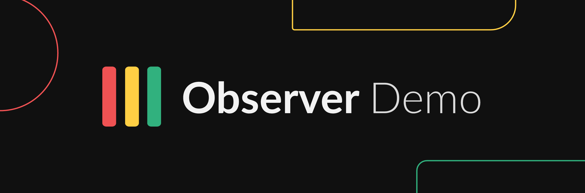

<p align="center">
    
</p>

<p align="center">
  <a href="https://status.use.observer"></a>
</p>

A self-contained stack that exercises **every probe source Observer supports**, against real local services. One `docker compose up`, one `observer apply`, and you have a live dashboard with sixteen metrics across fourteen source types — including one that intentionally flips status every minute so you can watch Observer react.

Nothing is mocked. The agent genuinely pings containers, runs SQL, completes gRPC health checks, receives OTLP pushes, and queries Loki and Elasticsearch. Raw data never leaves your machine; the agent pushes only the computed verdicts to Observer Cloud.

## What's inside

| Container | Purpose | Observer source |
|---|---|---|
| `observer-agent` | The Observer agent | everything below |
| `prometheus` | Self-scraping Prometheus | `prometheus` (PromQL), `http` |
| `postgres`, `mysql`, `redis`, `mongo` | Seeded databases | `database` × 4 kinds, `tcp`, `icmp` |
| `grpc` | agnhost gRPC health server | `grpc` |
| `websocket` | Echo server | `websocket` round-trip |
| `loki` + `loki-logger` | Log store + producer | `loki` (LogQL) |
| `elasticsearch` + `es-seeder` | Search + document producer | `elasticsearch` (aggs) |
| `otlp-pusher` | Gauge pusher | `otlp` (push) |
| — | The agent's own machine | `host` (CPU) |
| — | You | `manual` |
| — (optional) | Your AWS account | `cloudwatch` |

Plus external checks with no container at all: `dns` (resolve via 1.1.1.1) and `tls_cert` (certificate expiry).

## Prerequisites

- Docker with Compose
- An [Observer](https://use.observer) account (free tier is fine)
- The [Observer CLI](https://github.com/useobserver/cli)
- ~3 GB free RAM (Elasticsearch is the hungry one)

## Quickstart

**1. Create an agent** in the Observer console: *Agents → New agent*, name it exactly `demo-agent`, copy the `obs_live_*` key (it is shown once).

**2. Start the stack:**

```sh
cp .env.example .env      # paste your AGENT_KEY
docker compose up -d
```

**3. Apply the config** (create an API key with `write:config` scope under *API keys* in the console):

```sh
export OBSERVER_API_KEY=obs_pub_...
observer apply -f observer.yaml
```

Within a minute or two the console fills in: sixteen metrics, three services, two SLOs. Watch **Queue depth (OTLP push)** — its value follows the clock's seconds, so it crosses healthy → degraded → unhealthy roughly once a minute. That's not a bug; that's the demo.

**4. Optional — publish a status page:** uncomment the `pages:` block at the bottom of `observer.yaml`, pick a globally unique subdomain, and re-run `observer apply`. Your page goes live at `https://<subdomain>.use.observer`.

**5. Optional — CloudWatch:** uncomment the AWS blocks in `.env`, `docker-compose.yml`, and `observer.yaml`. Read-only credentials (`cloudwatch:GetMetricData`) suffice; the agent uses the standard AWS credential chain and never sends credentials to Observer Cloud.

## Things worth trying

- **Kill a database:** `docker compose stop mysql` — watch the MySQL metric go unhealthy, the TCP/ICMP checks stay scoped to postgres, and the Datastores service degrade.
- **Kill the agent:** `docker compose stop observer-agent` — after ~3× the push interval, Observer marks the metrics stale (`no_data`) rather than freezing the last green verdict.
- **Flip the manual metric:** the "Payment vendor" metric has no probe; set its status from the console to see operator-controlled components.
- **Dry-run config changes:** edit `observer.yaml`, then `observer apply --dry-run -f observer.yaml` shows the diff without touching anything. `observer export --all` round-trips your console state back into YAML.

## Security notes

- Database DSNs live only in `docker-compose.yml` as environment variables on the agent. The config (`observer.yaml`) references them **by name** (`DEMO_POSTGRES_DSN`); Observer Cloud never sees a connection string.
- The database probes are read-only by construction: SELECT-only SQL parsing, a Redis command allowlist, and a MongoDB count-only spec.
- The OTLP receiver binds beyond loopback inside the compose network, so it requires a bearer token (`OTLP_TOKEN`).
- `cap_add: NET_RAW` on the agent exists solely for ICMP ping. Remove it (and the ICMP metric) if your policy forbids raw sockets.

## Teardown

```sh
docker compose down -v
```

Then delete the config-managed objects from Observer:

```sh
: > empty.yaml && echo 'apiVersion: observer/v1' > empty.yaml
observer apply --prune -f empty.yaml
```

(or delete them from the console).

## License

Apache-2.0. This repository is a read-only mirror published from the Observer monorepo; issues and PRs here are read, but changes land via the mirror.
